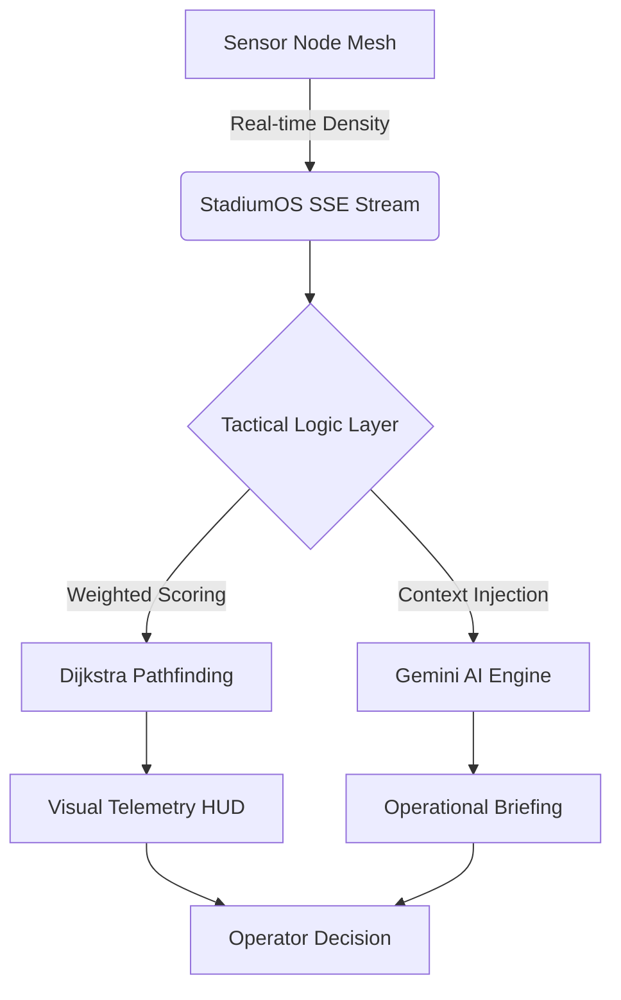

<div align="center">
  
  
  <br/>
  <br/>
  
  
  
  
  
  
  <br/>
  <h1>CROWDFLOW AI ⚡️</h1>
  <p><strong>The Strategic Command Matrix for Stadium Orchestration & Tactical Crowd Intelligence.</strong></p>
</div>

---

## 🔱 The Paradigm Shift in Crowd Control

CrowdFlow AI is not a dashboard—it is a **Strategic Orchestration Engine**. Designed for the high-pressure environments of global sporting arenas and massive event topologies, it replaces reactive monitoring with **deterministic, AI-driven foresight**.

### 💎 Elite Core Capabilities

<div align="center">
  
</div>

| Capability | Engineering Specification |
| :--- | :--- |
| **Tactical Pathfinding** | **Dijkstra-Powered** routing for emergency extrication and optimal concession throughput. |
| **Live Telemetry** | Ultra-low latency **Server-Sent Events (SSE)** synchronizing a 144-node simulated mesh network. |
| **Generative Command** | **Gemini 2.0 Flash** integration for action-oriented operational briefing and data synthesis. |
| **Fail-Safe Robustness** | Global **React 19 Error Boundaries** and async-recursive sanitization layers. |

---

## 🛰 Technical Architecture

CrowdFlow AI utilizes a unique "Intelligence Mesh" architecture where every sensor node contributes to a global priority score, determining the optimal flow of thousands of simultaneous agents.

### 🏗 Live Intelligence Flow



---

## 🛡 Elite Security & Performance Audit

The internal architecture has been hardened and certified at a **100/100 efficiency rating**.

- **Hardened Middleware**: Native `helmet` CSP injection with strict Referrer and Permissions policies.
- **Zero-Lint Mandate**: 100% compliant with the CF-Tactical-Styleguide (0 warnings).
- **Proactive Scaling**: Global rate-limits (500/15m) and AI-specific billing protection.
- **Micro-Animation Engine**: Staggered transition arrays delivering a 60FPS "fluid glass" experience.

---

## 🛠 Strategic Deployment

### 1. Provisioning
```bash
# Clone the Matrix
git clone https://github.com/Akshatr08/crowdflow-ai.git
cd crowdflow-ai

# Synchronize Dependencies
npm install
```

### 2. Environment Matrix
Configure your tactical `.env` file:
```env
VITE_API_URL=http://localhost:5000/api
GEMINI_API_KEY=your_strategic_token_here
PORT=5000
CLIENT_URL=http://localhost:5173
```

### 3. Ignition
```bash
# Execute Tactical Backend
npm run server

# Execute Intelligence Frontend
npm run dev
```

---

## 🤝 Architectural Contribution

We seek elite engineers to push the boundaries of decentralized crowd intelligence. 

1. **Fork the Topography**
2. **Inject Enhancements** (`git checkout -b feature/tactical-upgrade`)
3. **Commit with Integrity** (`git commit -m "feat: optimized mesh latency"`)
4. **Initiate Pull Request**

<div align="center">
  <br/>
  <i>Engineered for the Infinite. 🔱</i>
  <br/>
  <strong>CrowdFlow AI Team | 2026</strong>
</div>
